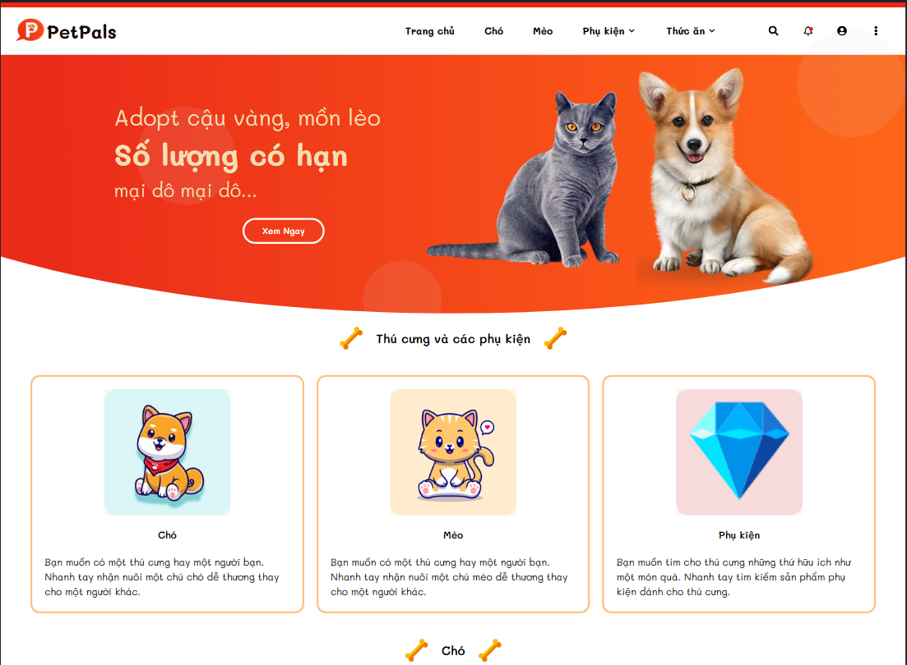
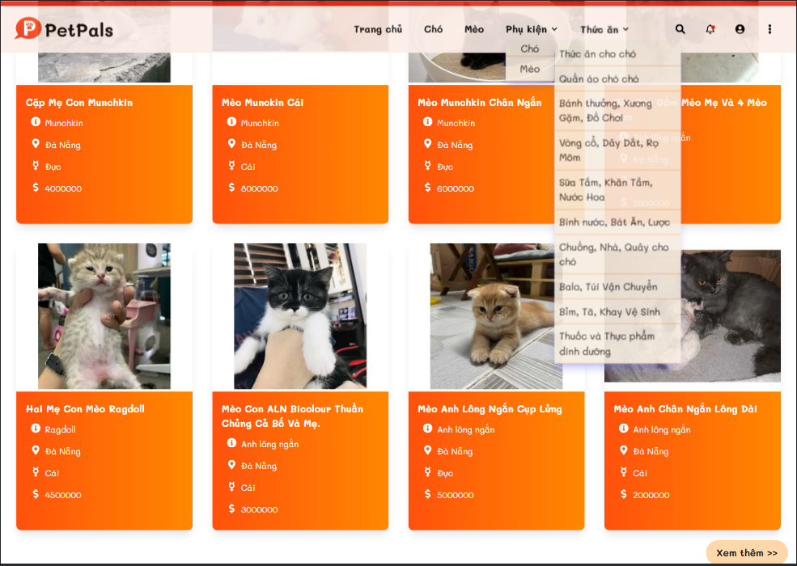
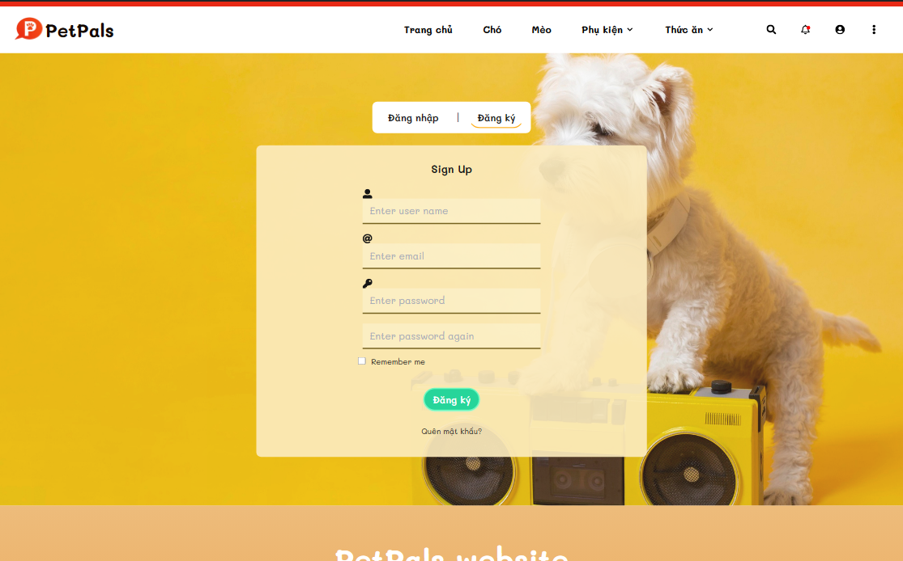
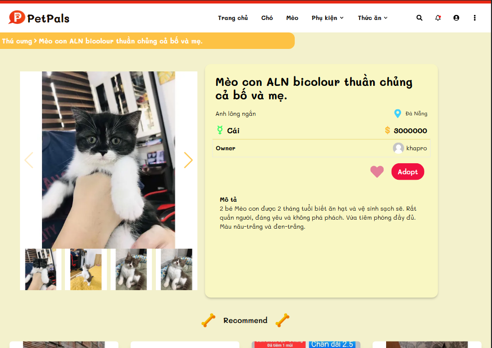

## Available Scripts

In the project directory, you can run:

### `npm install`

then run

### `npm start`

Runs the app in the development mode.\
Open [http://localhost:3001](http://localhost:3001) to view it in your browser.

## Preview

# Home page

# List product page

# Sign in / sign up page

# Detail page

## Demo

# `https://pet-pals-web.vercel.app/`
